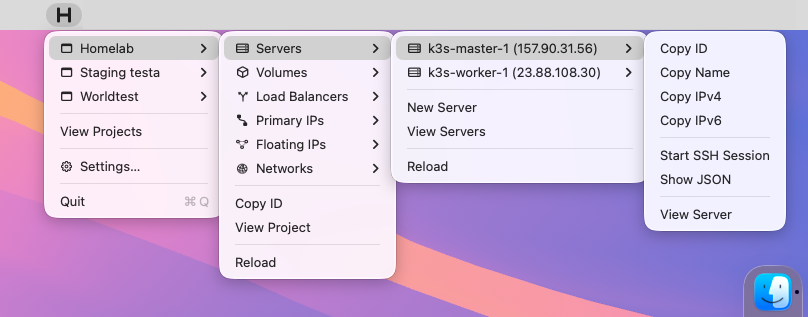
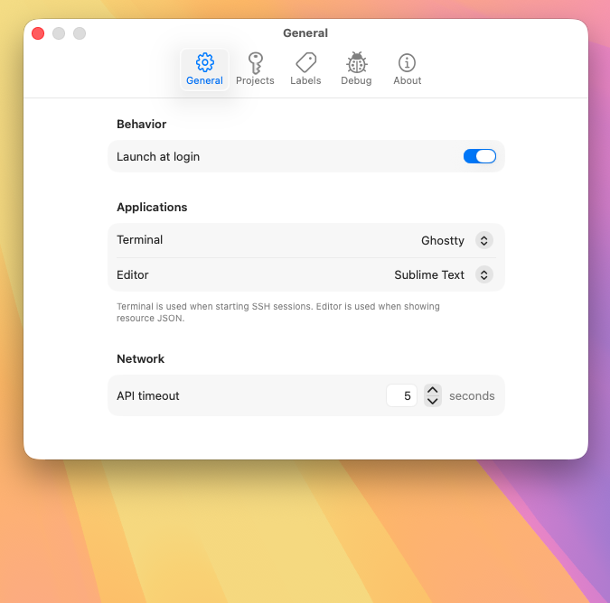
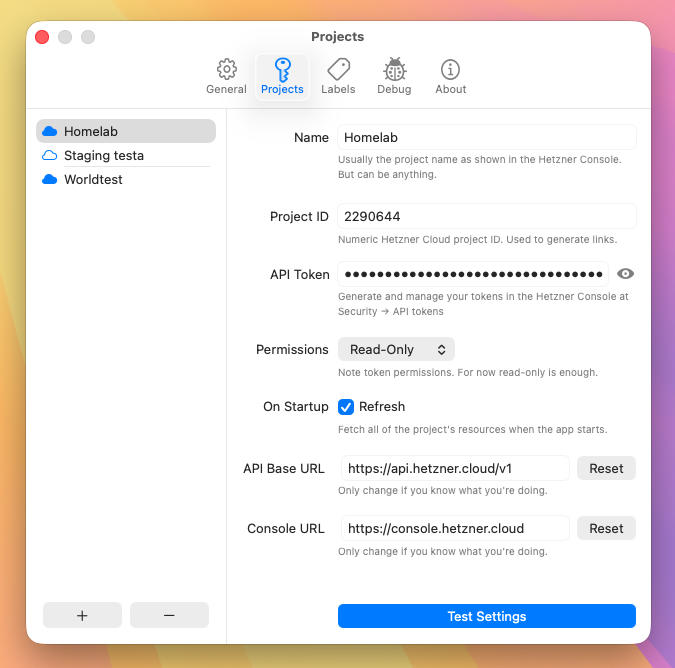
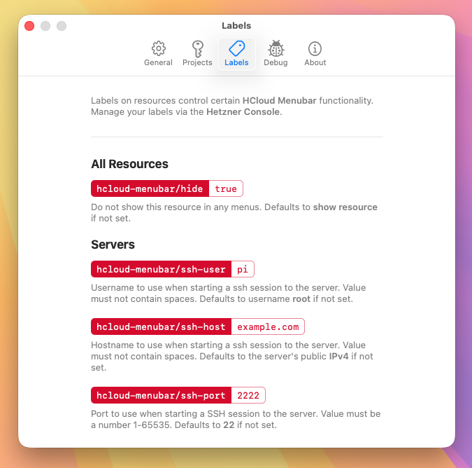
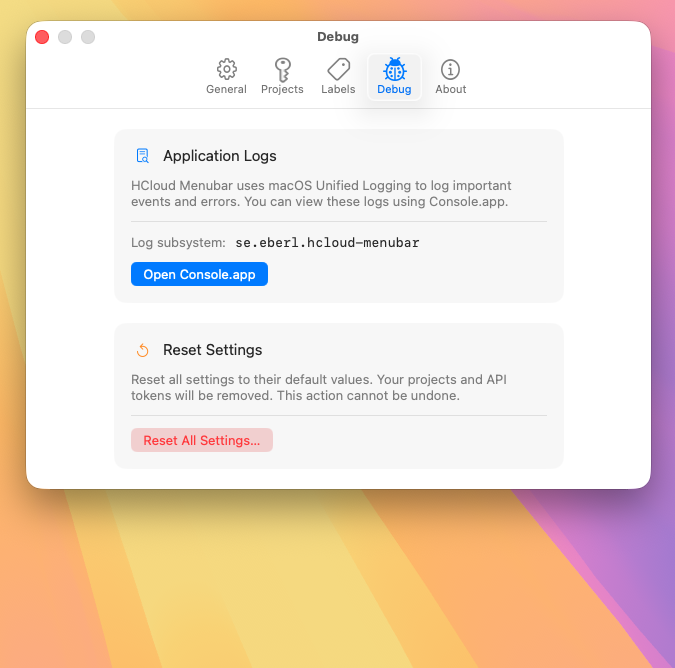
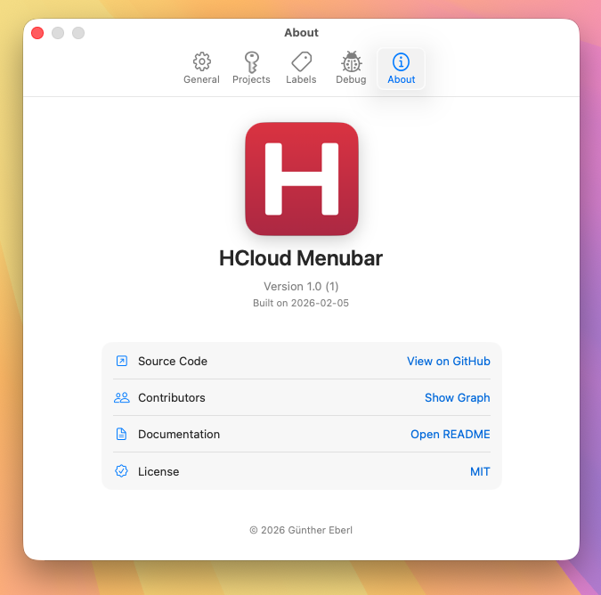

#  hcloud-menubar

*A lightweight macOS menu bar app for managing Hetzner Cloud resources.*

## Overview

`hcloud-menubar` brings your Hetzner Cloud projects directly into the macOS menu bar.

It is a fully native Swift application with zero external dependencies, focused on speed, transparency, and simplicity. It allows you to quickly inspect resources, launch SSH sessions, and jump straight into the Hetzner Cloud Console — without opening a browser first.

## Features

- Access your Hetzner Cloud projects directly from the macOS menu bar
- Multi-project and multi-environment support
- Deep-link directly into the Hetzner Cloud Console
- Launch SSH sessions instantly using:
  - macOS Terminal
  - Ghostty
  - iTerm
  - Kitty
  - Hyper
  - WezTerm
  - Warp
- View raw resource JSON using:
  - TextEdit
  - VSCode / VSCodium
  - Sublime Text
  - MacVim / VimR
  - Xcode
  - BBEdit
  - CotEditor
  - Nova
- Quickly copy IDs, names, and IP addresses to the clipboard
- Pure native Swift
- ~30 MB RAM usage during normal operation
- ~1.2 MB compiled binary size
- No tracking, analytics, or telemetry frameworks
- No external dependencies

## Heads Up

- This is **not a product**. This is **just [geberl's](https://github.com/geberl) hobby project**. One person, no contributors (yet), no company-support. Contributions are welcome.
- This is **not** an official Hetzner integration.
- This project is on purpose distributed exclusively as source code. By building the application yourself, you have full auditability over the code and can be certain that your API tokens remain private. This app is not distributed via the Mac App Store, Homebrew, Macports, or any pre-compiled binaries. If you find a compiled version of this app elsewhere, please note that it is not an official release and might be compromised.

## Screenshots

## Build Instructions

1. Open `hcloud-menubar/HCloud Menubar.xcodeproj` in Xcode
2. Build the project

### App Sandbox Note

Starting SSH sessions in most third-party terminal emulators requires disabling App Sandbox.

You can keep sandboxing enabled if you only use:

- macOS Terminal
- iTerm
- Kitty

## Recreating Icons

- `cd images`
- Edit file `icon-1024.png` as desired
- `./create_icons.sh icon-1024.png hcloud-menubar`
- The file `hcloud-menubar.icns` will be overwritten
- The directory `hcloud-menubar.iconset` will contain individual images in the sizes Xcode needs
- Drag and drop the generated images individually to the AppIcon asset

## Attributions

ChatGPT, Claude and Gemini were used as research tools during development, similar to how one would use a search engine. Some generated code was copy-pasted, but all of it was manually reviewed. No autonomous agents were let loose on this repo (yet).

The "H" in the logo is inspired by Hetzner's official branding. All related trademarks and rights belong to Hetzner.

Inspired by the following projects:

- [terhechte/OceanBar](https://github.com/terhechte/OceanBar)
- [andrewsomething/digitalocean-indicator](https://github.com/andrewsomething/digitalocean-indicator)
- [matryer/xbar](https://github.com/matryer/xbar)
